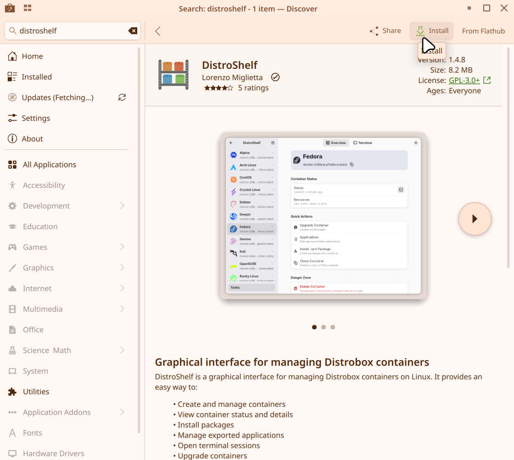
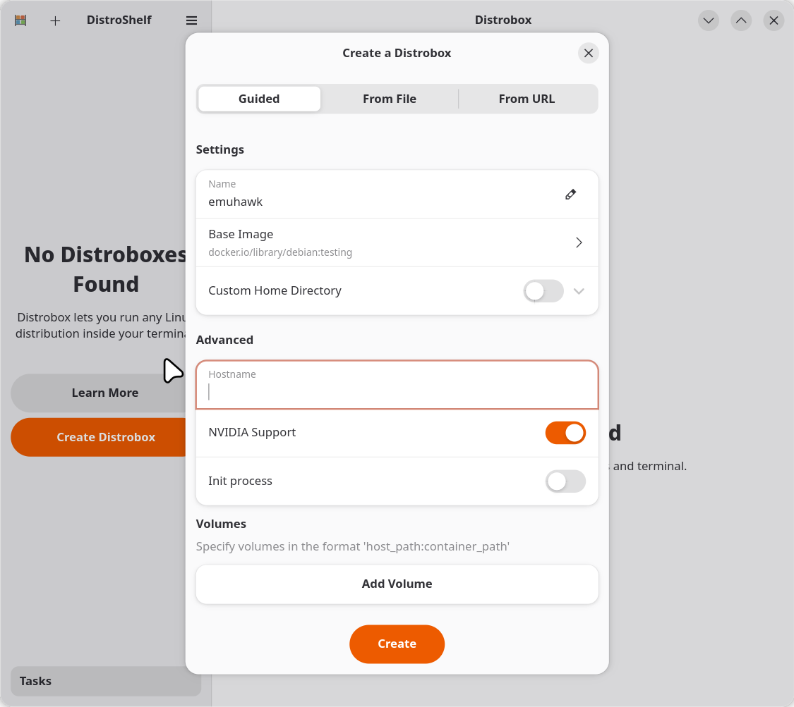
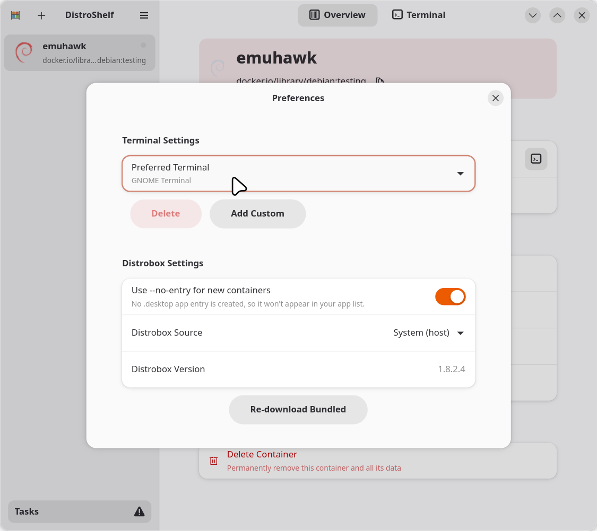
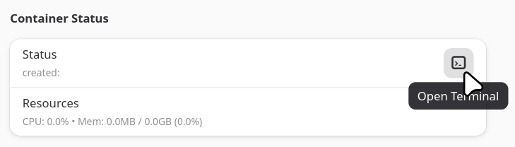
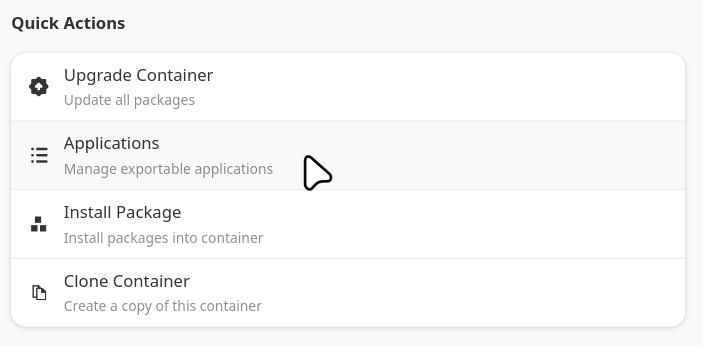
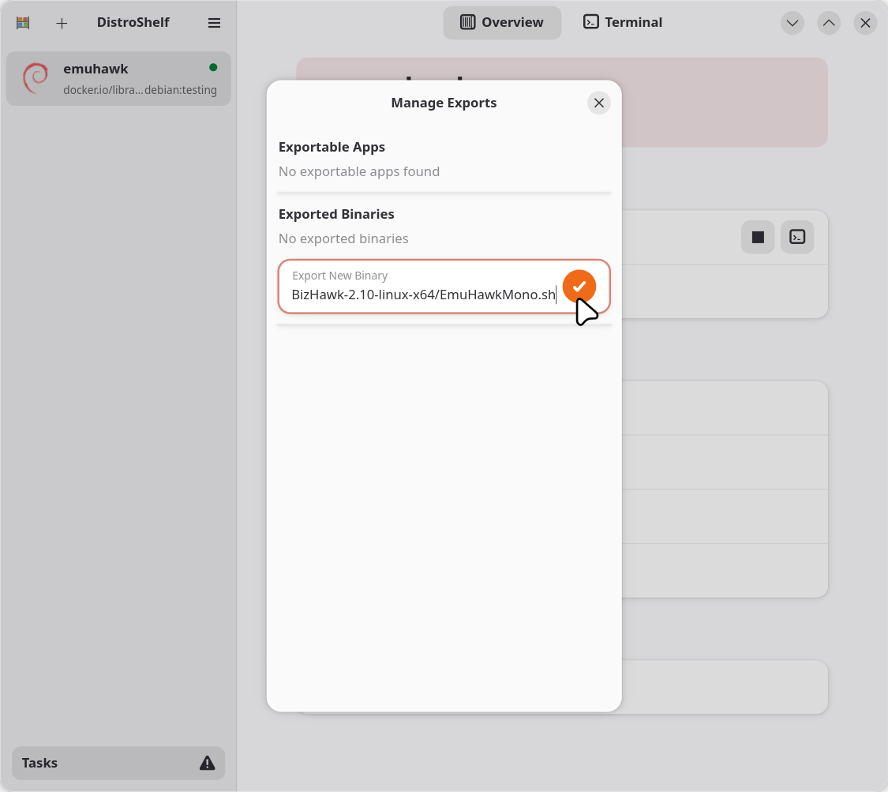

# EmuHawk on Immutable Linux
Linux distributions such as SteamOS are known as Immutable, which often means that their system files are read only by default. It is possible to make them writable, but any additions and changes will be wiped by the next system update.

## Prerequisites
1. Distrobox
2. [BizHawk](https://github.com/TASEmulators/BizHawk/releases)

## Native
### Setup
1. Download the **Linux version** of BizHawk (`BizHawk-<version>-linux-x64.tar.gz`)
2. Extract tarball contents wherever desired
### Installation
#### Option 1: CLI
Source: [SpenserHaddad](https://gist.github.com/SpenserHaddad/417a772aea5be99d563fe73295bb62fb)

3. Create the Distrobox container

> You can change the image if desired, though you will also need to update the `additional-packages` entries accordingly to what the distribution image would need.

```
distrobox create \
    --name BizHawkDistro \
    --image debian:trixie-20240513-slim \
    --additional-packages "mesa-utils libgtk2.0-0 libsdl-sound1.2 mono-complete lua5.4 liblua5.4-dev"
```

4. Create Export Proxy for BizHawk to use the Container’s Environment
```
distrobox-enter BizHawkDistro -- distrobox-export \ 
    --bin /path/to/BizHawk_Extract/EmuHawkMono.sh \
    --export-path /path/to/desired_directory/
```

5. Launch BizHawk using the export shell script
```
./path/to/exported_directory/EmuHawkMono.sh
```

#### Option 2: GUI (Mostly, Distroshelf)

Note: Although Distroshelf is used for this guide, other Distrobox GUI Wrappers such as Kontainer should also work, though the steps required will differ.

3. Install Distroshelf from your Software Center (i.e. Discover)



4. Open Distroshelf
5. Click the **+** button on the top-right corner of the app. Specify a name and the base image to use

> We will use docker.io/library/debian:testing for the image, though you are free to use other images (You will need to accommodate for the upcoming steps if you do so)



6. Click “Create”
7. Once the container is created, exit the dialog window.
8. If you do not have Gnome Terminal (which is most likely on SteamOS), you will need to change the Preferred terminal in the Settings
    <ol type="a">
        <li>Click the ☰ (Hamburger) menu on the upper-right to open Main Menu and then click Settings.</li>
        <li>Click on "Preferred Terminal" and choose a terminal present in your system (e.g. Konsole on KDE Plasma systems such as SteamOS)</li>
        <li>Exit the Settings window afterwards.</li>
    </ol>



9. Click the terminal icon on the status section



10. Wait for the Container to install basic-packages
11. Install BizHawk’s dependencies
```
sudo apt install mesa-utils libgtk2.0-0 libsdl-sound1.2 mono-complete lua5.4 liblua5.4-dev
```
12. Wait for the dependencies to finish installing
13. Exit/Close the terminal
14. In the _Quick Actions_ section, select _Applications_



15. In the Export New Binary field, enter the path to EmuHawkMono.sh in the extracted BizHawk folder



16. Click the 🗸 button. If it warns that the binary already exists on the host, click _Export Anyway_
17. The exported file should be located in `/home/<user>/.local/bin/EmuHawkMono.sh`. Move this anywhere as desired
18. Run the exported file

## Proton
### Setup
1. Download the **Windows version** of BizHawk (`BizHawk-<version>-win-x64.zip`)
2. Extract zip contents wherever desired

### Installation (Steam)
3. Open Steam
4. Click _Add a Game_, then click _Add a Non-Steam Game…_.
5. Click _Browse_ on the bottom-left corner of the Add Non-Steam Game dialog window
6. Find _EmuHawk.exe_ in your extracted BizHawk folder and select it
7. Click Add Selected Programs back in the Add Non-Steam Game dialog
8. Now right-click _EmuHawk.exe_ in your Steam Library and select Properties
9. Go to the _Compatability_ tab
10. Check the Force the use of a specific Steam Play compatibility tool, then select your preferred Proton version
11. Play
